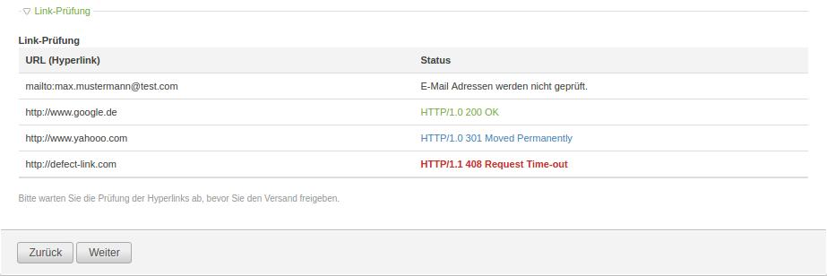

[](https://travis-ci.org/heimrichhannot/contao-linkchecker-bundle/)
[](https://coveralls.io/github/heimrichhannot/contao-linkchecker-bundle)

# Contao link checker Bundle

Simple link checker tool, that comes with an back end widget and LinkChecker class.
Using php get_headers() function. Link test within widget is done via xhr call.


*LinkChecker back end widget*


## Technical instructions

### Test links

If you want to test a single link, or multiple links, simply call:

```
\Contao\System::getContainer()->get('huh.linkchecker.manager.linkchecker')test('http://www.google.de');
\Contao\System::getContainer()->get('huh.linkchecker.manager.linkchecker')test(array('http://www.google.de', 'http://www.twitter.com'));
```

### Back end widget / field

In back end mode there is a widget available called `linkChecker`;
Provide a valid `load_callback` within you DataContainer field configuration.


```
//tl_sample.php 

'linkChecker'       => array(
	'label'         => &$GLOBALS['TL_LANG']['tl_sample']['linkChecker'],
	'inputType'     => 'linkChecker',
	'load_callback' => array(
		array('MyClass', 'getLinkCheckerHtml'),
	),
),
```

You can return html-code with anchor tags, a single link or an array of links within your `load_callback`.

```
// MyClass

public function getLinkCheckerHtml($varValue, \DataContainer $dc)
{
	return '<a href="http://google.de">Google</a>'
}

```
